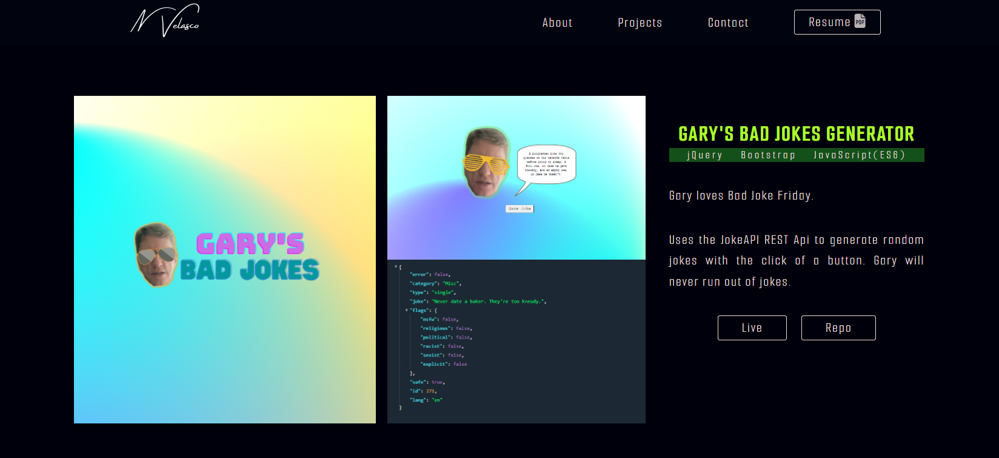
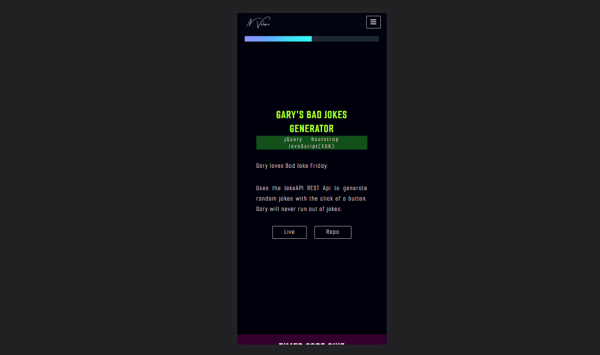

# My Portfolio

Hello!

Welcome to my portfolio repository.

My name is Neema, a web developer with an inclination towards design and game development.

 

## What to expect

* Showcase of selected projects that I have worked on recently.

* Click on each project to view the deployed app or repo.

* My contact details, downloadable pdf of resume, and links to socials.

* Responsive layout - design adapts to any screen size.

    
    

*If you're interested in more projects or information, please feel free to reach out to me.*

 

## Design

Inspired by the portfolio designs of [Brittany Chiang](https://brittanychiang.com/#about) and [Shane Mielke](https://www.shanemielke.com/).

 

## Deployed Page

[Link to my portfolio](https://nvsco-10.github.io/my-portfolio/)

 

## License 

This code is licensed under the MIT License.

